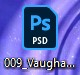
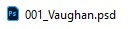
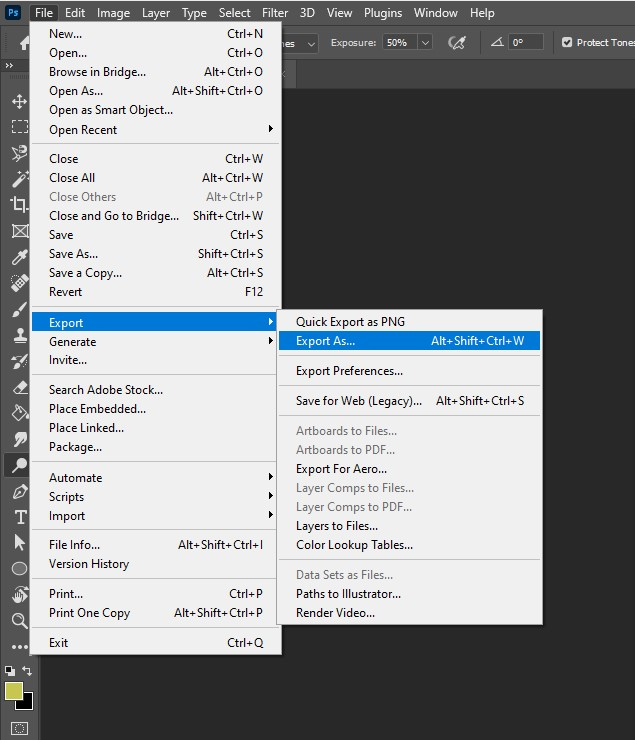
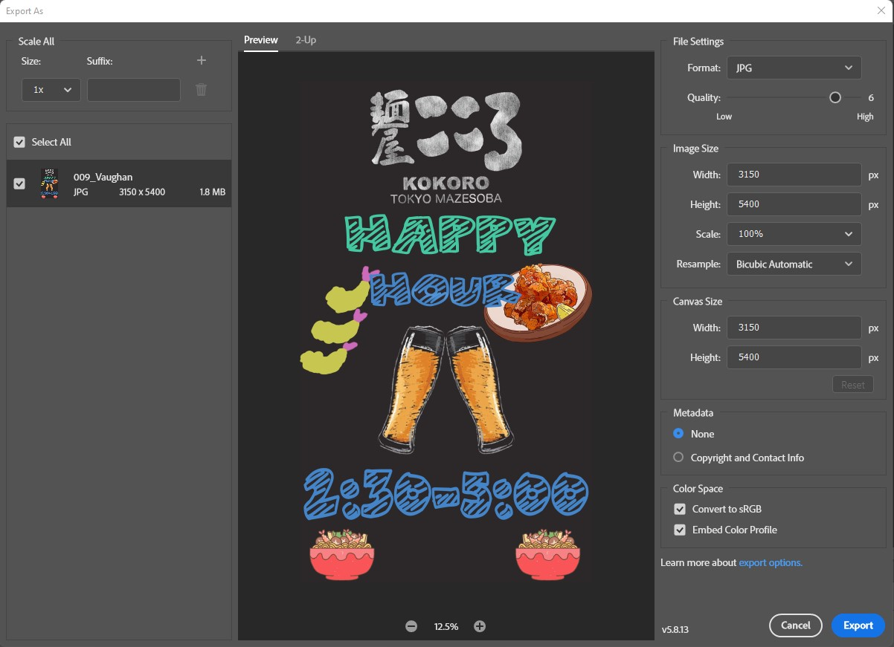

## Overview

When you have completed a Photoshop project, you will need to have a file that can be used in other applications which is what a Photoshop (.psd) file can not do. To get a version of your Photoshop project that cant be used in other applications you will need to export that file into a different file type.

This guide will guide you through the process of exporting a Photoshop file as a JPG file so you can use your Photoshop projects in anything you want.

!!! warning
    This guide assumes that you already have a completed Photoshop project ready to export.

## Getting Started

!!! danger "Prerequisite"
    Make sure you have Adobe Photoshop installed

Start by opening your photoshop file by double clicking it in your file explorer or desktop

* On the desktop, it will look like this { align=left }

{ align=left } In the file explorer, it will look like this

## Opening The Export Menu

Once you have the Photoshop file open, to the top left of the window and click on file. You will see a dropdown menu with several file options. Navigate down the dropdown menu until you see a button that says "Export" and click on it. You will now see a second dropdown menu with different export options, in that menu, click on the option that says "Export as...".

<figure markdown>
  
  <figcaption>Here is the full dropdown menu with the "Export as..." button highlighted.</figcaption>
</figure>

## Navigating The Export Menu

You will now see the export menu. Here you will find many options for exporting your Photoshop project. Click on the format dropdown menu under "file settings" on the top right and select JPG. Below this you will see the quality option, select your desired image quality.

!!! warning
    Higher image qualities will result in larger file sizes and longer load times.

Below you will see options for resizing the image, you can resize the image to your desired size here, leave the rest of the options as default. Finally on the bottom left of the menu click the blue export button and select a location to save your file.

<figure markdown>
  
  <figcaption>Here is the full export menu of a sample project with the JPG option selected.</figcaption>
</figure>

## Conclusion

By the end of the section, you will have learned the following:

- [x] How to open the export menu
- [x] How to change the quality of your export
- [x] How to export a file as a .jpg file
