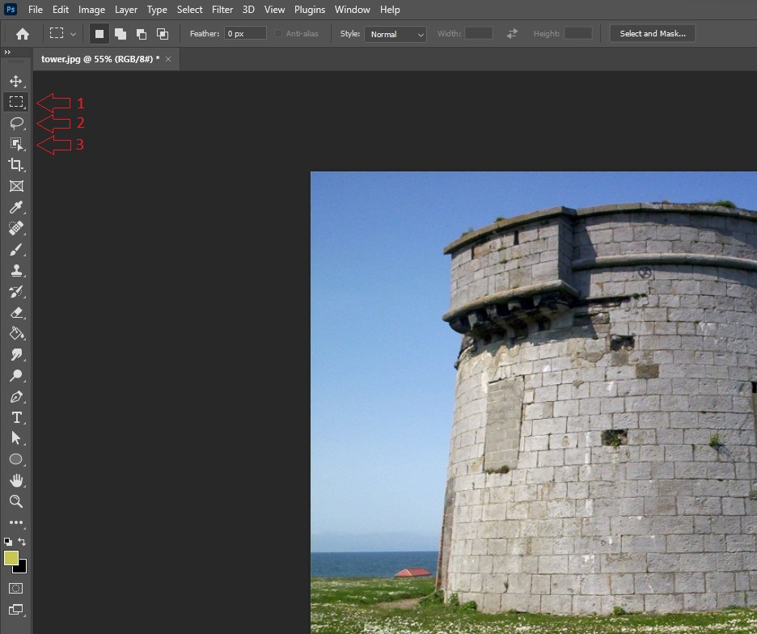

## Overview

When working with images in Photoshop it is important to work non-destructively as to not damage the original image. With a layer mask it is possible crop and cut out portions of an image without actually removing anything from the original image.

These instructions will guide you through the process of creating a layer mask so you can effectively work non-destructively in Photoshop.

## Getting Started

!!! danger "Prerequisite"
    * Make sure you have Adobe Photoshop installed
    * Have an image ready to be edited

Start by opening your selected image in Photoshop. This can be done by right clicking the image in your file explorer or desktop, clicking on open with, and selecting Adobe Photoshop. 

<figure markdown>
  
  <figcaption>Here is the menu that is shown when right clcking an image and selecting open with</figcaption>
</figure>

## Making a Selection

Once you have your image opened in Photoshop you will need to make a selection of what you want to mask. On the left side you will see you list of available Photoshop tools, of these tools you will have three options for making selections.

1. The shape selection tools for making selections in the shape of a rectangle or an ellipse

2. The abstract selection tools for making selections with custom shapes

3. The smart selection tools that intelligently makes selections based on the content of the image

<figure markdown>
  
  <figcaption>Location of the selection tools on the left.</figcaption>
</figure>

Once you have selected your selection tool, make a selection around the object you wish to make a layer mask of by holding left click and dragging the cursor around the object. You will see a dotted line around the area you have selected.

<figure markdown>
  
  <figcaption>Dotted lines around the object shows that the object has been selected.</figcaption>
</figure>

You may inverse this selection by right clicking the selection and clicking on select inverse. This will select everything but what was initially selected.

<figure markdown>
  
  <figcaption>This menu will pop up when you right click a selection, the select inverse option has been highlighted.</figcaption>
</figure>

## Making The Mask

Once you have made your selection, you can create the layer mask. To do this, click on the layer mask button that is at the bottom of the layers tab on the right. (it will look like a rectangle with a circle in it.)

!!! warning
    Make sure you are on the correct layer before making the mask.

<figure markdown>
  
  <figcaption>Here is where the layer mask button can be found.</figcaption>
</figure>

When you click the layer mask button you will see that everything but what you selected has been removed. You will also see in the layer that the original image used for the mask is completely untouched. This means the image was edited non-destructively as there were no changes to the original.

<figure markdown>
  
  <figcaption>This is an example of a layer mask.</figcaption>
</figure>

## Conclusion

By the end of the section, you will have learned the following:

- [x] How to open an image in Photoshop
- [x] How to make a selection in Photoshop
- [x] How to create a layer mask in Photoshop
