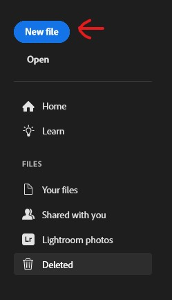
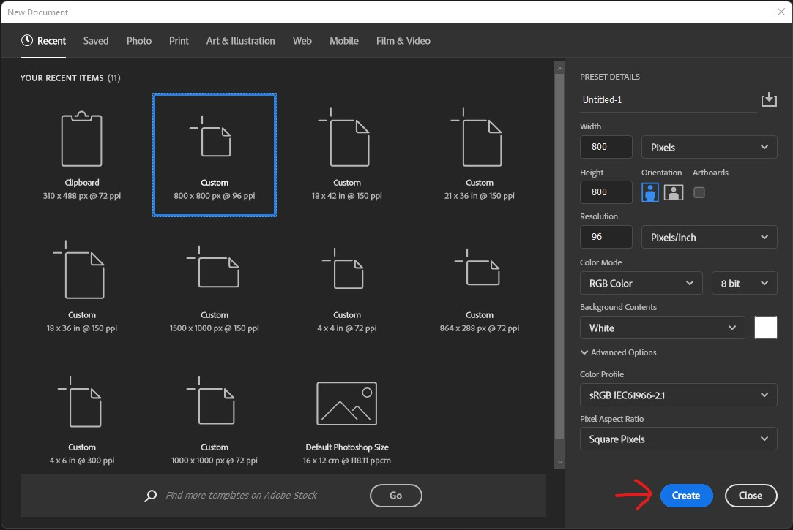
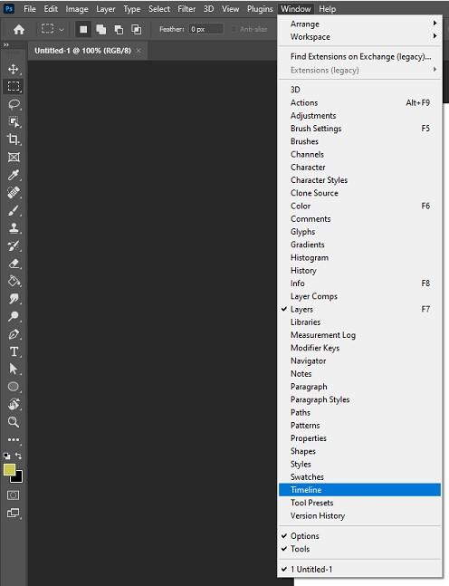
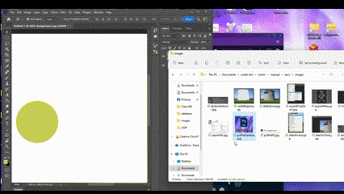
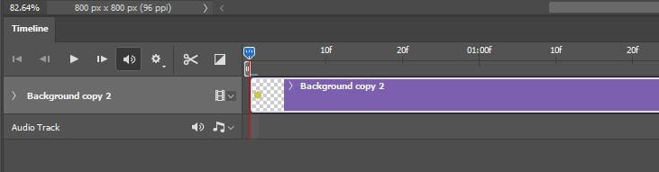
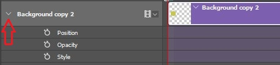
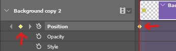

## Overview

Animations are something that can really improve a web app and draw a users attention. Animations can be made in made in photoshop using a tool called the timeline which allows you to make images move and change over time.

These instructions will guide you through the process of creating animations using the timeline in photoshop so you can add flair to your future web projects.

## Getting Started

!!! danger "Prerequisite"
    * Make sure you have Adobe Photoshop installed
    * Have an image readily available

Start by opening a new blank Photoshop file. This can be done by opening Adobe Photoshop and clicking on the blue new file button on the top right.

<figure markdown>
  
  <figcaption>Click this button to start a new file.</figcaption>
</figure>

When you click on the new file button you will see a menu of different image sizes, click on the image size that best fits the animation you are trying to make and click on the blue create button on the bottom right, don't worry about the options just leave them default. You will then see an empty Photoshop canvas ready to place images into.

<figure markdown>
  
  <figcaption>Here is the new project menu with a arrow pointing to the create button for starting new projects.</figcaption>
</figure>

Next you will need to bring up the timeline tool that will help you create the keyframes for the animation. To do this, click on the window option at the top of the window which will bring down a dropdown menu of tools. The tool you will want to click on is timeline which is near the bottom of the menu.

<figure markdown>
  
  <figcaption>Clicking on the window button brings up the dropdown menu where the timeline button can be found.</figcaption>
</figure>

Now that you have the timeline open, you can now add the image you wish to animate. To do this, just drag the image from your file explorer or desktop into the Photoshop canvas. The new image will be on its own layer.

<figure markdown>
  
  <figcaption>It's a simple as dragging the image into your project.</figcaption>
</figure>

Now that everything is set up, you are ready to start animating.

## Animating

There are many ways to animate things in Photoshop, this guide will show you how make images move around.

Start by clicking the Create Video Timeline button in the center of the Timeline menu. This will start a new timeline for your animation and you will see your image as a purple bar in the timeline.

<figure markdown>
  
  <figcaption>You will see your image in the timeline as well as some options to the left of it.</figcaption>
</figure>

On the left of the name of your image you will see an arrow, click on it to open the dropdown menu of animation types. You will see three different animation options.

* Position
* Opacity
* Style

<figure markdown>
  
  <figcaption>Clicking on this arrow will open the animation options menu.</figcaption>
</figure>

For this guide you will be using Position, so click on the stopwatch icon beside Position and you will see a yellow diamond at the beginning of your timeline as well as beside the stopwatch icon. This is your first keyframe which will determine the starting position of your animation. 

!!! warning
    Make sure the position of your timestamp bar is at the biginning of your timeline.

<figure markdown>
  
  <figcaption>Here is the new keyframe that was created at the beginning of the timeline under the timestamp bar.</figcaption>
</figure>

Move the timestamp bar down the timeline to your desired time by clicking the blue marker at the top of the bar and dragging to you desired point. Now use the move tool located at the top of the toolbar to move your image to a new location on the canvas. This will automatically create a new keyframe where you placed the timestamp bar.

<figure markdown>
  
  <figcaption>When the image is moved you will see a second keyframe appear when the timestamp bar is.</figcaption>
</figure>

Congratulations you can now create animations using Adobe Photoshop!

## Conclusion

By the end of the section, you will have learned the following:

- [x] How to create a new blank Photoshop canvas
- [x] How to open the time line for creating animations
- [x] How to make an image move
